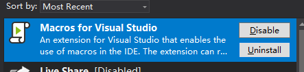
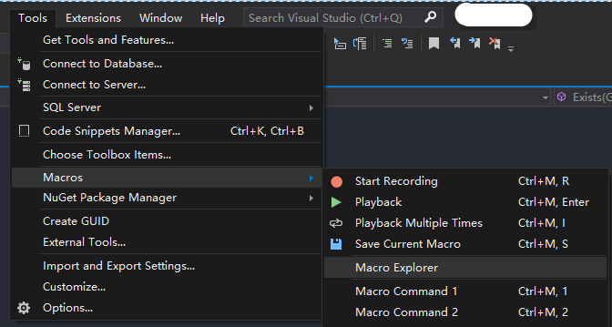
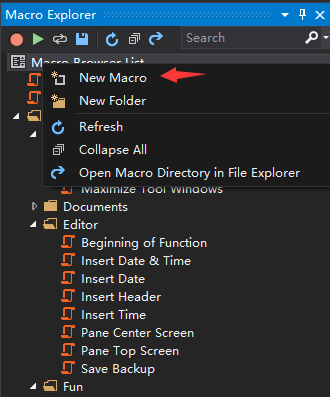

# VS2019 快捷键插入当前时间

在vs中修改代码，会标注一下修改信息，所以想要有个快捷键，按一下就能到插入当前时间，修改人信息，备注信息等，如：

``` c#
// 2019/07/09 16:31:58
// ylka
// 新增字段
```

## 安装插件

vs上安装 Maros 扩展：



打开 Maros Explorer  


新建一个 Maros  


参考 Editor 里的 Insert Date & Time，做一点修改，主要是新增了换行后的对齐需要的空格 pre

``` js
var doc = dte.ActiveDocument;
var colNum = doc.Selection.AnchorColumn;
var pre = '';
for (var i = 0; i < colNum-1; i++)
    pre += " ";

Macro.InsertText("// " + year + "/" + month + "/" + day + " " + hours + ":" + minutes + ":" + seconds+"\n");
Macro.InsertText(pre + "// ylka\n");
Macro.InsertText(pre + "// ");
```

右键文件 Assign Shortcut，设置一下快捷键，这样就可以按 `Ctrl+M，1` 添加我们的注释了。

## 参考链接

1 [VS中如何快捷地给自己的代码添加创建信息注释](https://www.cnblogs.com/weihanli/p/5970053.html)
