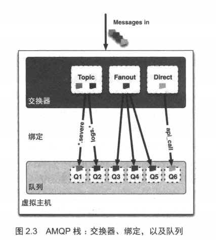

# RabbitMQ

## 消息通信
### 一 消费者和生产者

1. 消息包含两部分内容：有效载荷（payload）和标签（label）。有效载荷就是你想要传输的数据。
2. 在消息路由过程中，消息的标签并没有随有效载荷一同传递。
3. 建立TCP连接，然后创建一条AMQP信道。信道是建立在“真实的”TCP 连接内的虚拟连接。
4. AMQP 命令都是通过信道发送出去的。
5. 每条信道都会被指派一个唯一 ID（AMQP 库会帮你记住ID）。
6. 不论是发布消息、订阅队列或是接收消息，这些动作都是通过信道完成的。
7. 为什么不直接通过 TCP 连接发送 AMQP 命令呢？主要原因在于对操作系统来说建立和销毁 TCP 会话是非常昂贵的开销。
8. 把 RabbitMQ 看作软件的路由器

### 二 队列

AMQP 消息路由必须有三部分：交换器、队列和绑定。
生产者把消息发布到交换器上；消息最终到达队列，并被消费者接收；绑定决定了消息如何从路由器路由到特定的队列。

当 Rabbit 队列拥有多个消费者时，队列收到的消息将以循环（route-robin）的方式发送给消费者。每条消息只会发送给一个订阅的消费者。
消费者接收到的每一条消息都必须进行确认。

### 三 交换器和绑定

服务器会根据路由键将消息从交换器路由到队列；一共有4种类型的路由器：direct，fanout，topic 和 headers。

direct 交换器非常简单：如果路由键匹配的话，消息就被投递到对应的队列

fanout交换器：将收到的消息广播到绑定的队列上

topic交换器：使得来自不同源头的消息能够到达同一个队列

### 三 vhost (虚拟主机)

本质是一个 mini 版的 RabbitMQ 服务器，拥有自己的队列、交换器和绑定，更重要的是，它拥有自己的权限机制。
默认vhost：“/”,使用缺省的 guest 用户名和密码 guest 就可以访问默认 vhost。
在 RabbitMQ 的例子中，权限控制是以 vhost 为单位的。

### 四 持久化
- 把它的投递方式设置为2（持久）
- 发送到持久化的交换器
- 到达持久化的队列

当发布一条持久化的消息到持久交换器上时，Rabbit 会在消息提交到日志文件后才发送响应。

